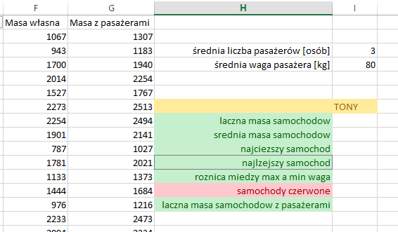

# 219-Excell

### Sprawdzian Excell 1 - 2024.11.04

Otwórz plik Sprawdzian.xlsx a następnie wykonaj poniższe zadania:

#### Zadanie 1. (7 punktów)
Zaznacz na czerwono (tło komórki) jeden z samochodów który ma najdłuższą nazwę modelu,
Aby przeprawić promem wszystkie auta musisz podać ich masę. Zapisz poniżej i wypisz w tabeli w arkuszu dane w tonach:
- łączna masę własną samochodów
- średnią masę własną samochodu
- który samochód waży najwięcej (nr VIN)
- który samochód waży najmniej (nr VIN)
- jaka jest różnica między najcięższym i najlżejszym samochodem
- ile jest samochodów zielonych

|

<!--
#### Zadanie 2. (4 punkty)
Dodaj nową kolumnę do istniejącego arkusza i nazwij ją "Pokład" a następnie za pomocą odpowiedniej funkcji dokonaj sprawdzenia: 
- Jeśli samochód będzie ważył więcej niż 1.5 tony to wypisz obok jego nazwy tekst “dolny pokład” a jeśli mniejsza niż 1.5 tony “górny pokład”.
- Sprawdź i napisz ile popłynie na górnym a ile na dolnym pokładzie.

-->

#### Zadanie 2. (4 punkty)
Zdefiniuj dwie nowe komórki w których pojawią się parametry (liczby) opisane jako "Średnia liczba pasażerów" "Średnia waga pasażera". Dodaj nową kolumnę o nagłówku Maasa z pasażerami" gdzie pojawi się wynik sumy masy każdego samochodu oraz ilocznu Sredniej liczby pasażerów i Średniej wagi pasażera. Zsumuj ponownie masę wszystkich samochodów z pasażerami i umieść w tabelce jako łączna masa samochodów z pasażerami tak, aby zmieniając parametry zmieniała się również łączna masa. 

#### Zadanie 3. (5 punktów)

Dodaj nowy arkusz i zmień jego nazwę na “Zadanie 3”. Wypisz 30 losowych dat w jednej kolumnie, a w kolumnie obok wypisz słowo “ŚWIĘTO” ale tylko jeśli dzień jest niedzielą. (postaraj się użyć tylko dwie kolumny)

#### Zadanie 4 (5 punktów)

W arkuszu 4 wygeneruj przy pomocy formuł excella 20 losowych adresów IPv4 zbudowanych z czterech liczb z zakresu 0-255. Przykładowy adres to: 158.69.31.17 (użyj funkcji ZŁĄCZ.TEKSTY)

<!--
#### Zadanie 5 (4 punktów)

Korzystając z generatora danych www.mockaroo.com wygeneruj bazę, która będzie zawierać 500 osób z następującymi danymi: Imię, Nazwisko, email, płeć a następnie zaimportuj wygenerowany plik do Excell jako kolejny arkusz o nazwie "Zadanie 5".

-->

Po zakończeniu pracy zapisz skoroszyt w utworzonym przez siebie na pulpicie folderze nazwanym wg następującego schematu: “Sprawdzian_ImięNazwisko_Klasa”

## Praca domowa

W oparciu o ogólnie dostępne dane przygotuj wykres prezentujący skład atmosfery ziemi. Zapreznuj dane w sposób pozwalający na porównanie poszczególnych składników. 
